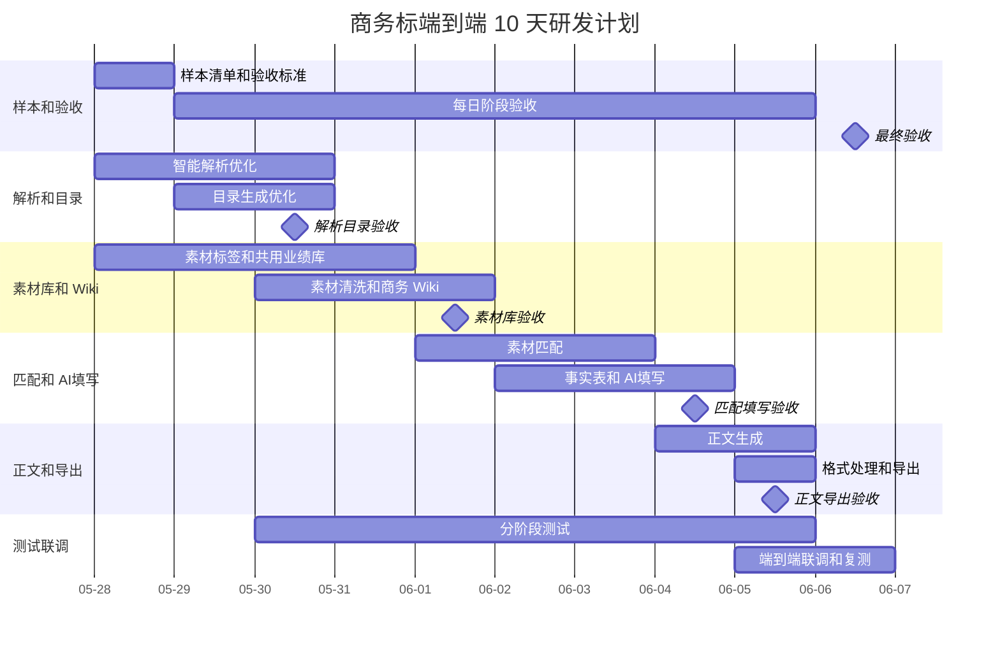

# 研发计划

## 1. 当前目标

用 10 天左右把商务标端到端跑通。

本轮只做商务标主链路，不展开技术标质量提升。技术标只做联动检查，确保商务标改动不破坏现有入口和测试。

商务标主链路：

```text
智能解析 -> 建项目 -> 生成目录 -> 目录审核 -> 素材匹配 -> 素材和填写审核 -> 生成正文 -> 在线共创 -> 格式处理 -> 导出 Word/PDF
```

建项目发生在解析完成之后，本轮按此口径推进。

## 2. 当前 Gap

| 模块 | 现状 | Gap | 本轮要做 |
| --- | --- | --- | --- |
| 智能解析 | 已有商务解析 Skill 和解析页面。 | 前端展示字段需要收口；附件空表和待填写 Word 提取仍要保留。 | 展示字段替换为项目名称、招标编号、招标人、代理机构、递交截止时间、资格要求、须知前附表、商务废标项、商务评分细则；继续保留附件空表和待填写 Word 提取。 |
| 目录生成 | 已有商务目录 Skill 和目录审核页。 | 目录质量不稳定，商务附件和承诺类目录不够准。 | 优化商务目录 Skill，并用真实样本校验。 |
| 素材匹配 | 已有 `business_gap_service` 和 `bid-business-gap-planner`。 | 现在更像缺口规划，不是清晰的素材匹配；处理方式还要对齐三类。 | 对齐固定素材、AI填写、人工补充；人工指定只作为纠偏动作。 |
| 项目事实表 | 已有 `business_gap_fact_table.py`。 | 字段还偏粗，商务报价、资质、承诺、附件、业绩字段要收口。 | 重整商务事实字段，作为 AI填写和正文生成输入。 |
| 素材库标签 | Wiki 有标签，原始素材标签能力不完整。 | Skill 无法稳定按标签缩小检索范围。 | 原始素材支持多标签，素材匹配输入带标签。 |
| 共用业绩库 | 目前只有商务素材里的业绩目录。 | 没有技术标和商务标共用的业绩库。 | 新增共用业绩库最小版本。 |
| AI填写 | 已有 `bid-business-table-fill`。 | 输入文件、待填写文件、事实表、素材证据的使用需要校验。 | 跑通至少一种表格或 Word 的 AI填写。 |
| 正文生成 | 已有 `bid-business-assembler`。 | 素材拼接和附件装配粗糙。 | 按审核后目录、素材、AI填写结果和事实表生成正文。 |
| 格式处理 | 已有 `bid-business-format-cleaner`。 | 需要真实 Word 验收标题、目录、分页、页眉、表格。 | 用真实样本打磨格式输出。 |
| 素材清洗/Wiki | 已有清洗和 Wiki Skill。 | 清洗和 Wiki 质量影响匹配。 | 优化清洗、Wiki 生成对商务素材的支持。 |

## 3. 需要新增或调整的模块

| 模块 | 负责人 | 动作 | 文件或位置 | 本轮目标 |
| --- | --- | --- | --- | --- |
| 原始素材标签 | 安博成 | 调整 | `BusinessMaterialDB.jsx`、`material_upload_metadata.py`、`material_update_metadata.py` | 上传和编辑素材时支持多标签。 |
| 共用业绩库 | 安博成 | 新增 | 新增后端 service/API，前端增加入口 | PostgreSQL 存业绩字段和文件路径，MinIO 存 Word 文件。 |
| 处理方式统计 | 肖雨航 | 调整 | `BusinessGapRecognition.jsx`、`business_gap_domain.py` | 统计只保留固定素材、AI填写、人工补充；人工指定移到纠偏动作。 |
| 素材匹配输入 | 肖雨航 | 调整 | `business_gap_planning.py`、`business_gap_service.py` | 给 Skill 输入目录、标签、素材类型、权限范围、事实表、业绩库候选。 |
| 商务事实表 | 肖雨航 | 优化 | `business_gap_fact_table.py` | 固定商务字段范围，补报价、资质、承诺、附件、业绩引用。 |
| AI填写链路 | 肖雨航 | 优化 | `business_gap_table_fill.py`、`business_gap_planning.py` | 明确待填写文件、来源素材、事实表、输出文件。 |
| 正文生成链路 | 彭维锋 | 优化 | `business_assembly.py`、`bid-business-assembler` | 读取审核后素材和 AI填写产物，生成可编辑正文。 |
| 格式导出链路 | 彭维锋 | 优化 | `business_assembly.py`、`business_document_service.py`、`bid-business-format-cleaner` | 生成后和编辑后都能做格式处理并导出。 |
| E2E 校验记录 | 王立博、马雨欣 | 校验 | 后端测试、前端手测记录 | 用一个真实商务标样本记录从解析到导出的阻断点。 |

## 4. Skill 优化清单

所有 Skill 优化都必须保持泛化，不能按单个样本硬编码文件名、字段值或答案。

| Skill | 作用 | 前端触发 | 本轮动作 | 负责人 | 目标 |
| --- | --- | --- | --- | --- | --- |
| `bid-business-wiki-material-builder` | 生成商务素材 Wiki。 | 素材库页点“生成 Wiki”或“刷新摘要”。 | 重点优化 | 安博成 | 生成能支持素材匹配的商务 Wiki 和证据说明。 |
| `bid-material-format-cleaner` | 清洗上传素材。 | 素材库页上传素材后点“清洗/预处理”。 | 重点优化 | 安博成 | 提升商务素材清洗质量，输出可检索、可引用内容。 |
| `bid-business-gap-planner` | 按目录规划素材和处理方式。 | 素材匹配页点“开始素材匹配”。 | 重点优化 | 肖雨航 | 对齐固定素材、AI填写、人工补充三类处理方式，结合标签和业绩库候选。 |
| `bid-business-fact-table-builder` | 生成商务项目事实表。 | 项目事实表页点“生成事实表/更新事实表”。 | 新增 | 肖雨航 | 生成报价、资质、承诺、附件、业绩引用等后续填写和正文要用的事实数据。 |
| `bid-business-table-fill` | 填写商务表格或 Word。 | 素材匹配页在 AI填写任务上点“开始 AI填写”。 | 重点优化 | 肖雨航 | 用事实表和来源素材填写空表或待填写 Word。 |
| `bid-business-tender-structured-parser` | 商务标招标文件解析。 | 智能解析页上传招标文件后点“开始解析”。 | 重点优化 | 彭维锋 | 前端展示字段按项目名称、招标编号、招标人、代理机构、递交截止时间、资格要求、须知前附表、商务废标项、商务评分细则收口；保留附件空表和待填写 Word 提取。 |
| `bid-business-outline-generator` | 生成商务标目录。 | 目录页点“生成目录”。 | 重点优化 | 彭维锋 | 生成更像真实商务标的目录，覆盖附件、承诺函、资质、业绩、评分响应。 |
| `bid-business-assembler` | 生成商务标正文。 | 素材匹配页审核完成后点“生成正文”。 | 重点优化 | 彭维锋 | 按审核后目录、素材、AI填写产物和事实表生成商务标正文。 |
| `bid-business-format-cleaner` | 清理商务标 Word 格式。 | 在线共创页点“格式处理/导出前整理”。 | 重点优化 | 彭维锋 | 清理标题、目录、分页、页眉、表格，输出可导出 Word。 |

## 5. Agent.md 共同约束

每个人的 Agent.md 都要先写共同约束：

- 先读 `doc/需求梳理.md`、`doc/代码结构梳理.md`、`doc/研发计划.md`。
- Skill 开发只能改对应 `sewpg-bid-backend/opencode/skill/<skill-name>/` 目录。
- 做 Skill 时不能改前端、API、service、数据库、存储、模板或其他 Skill。
- 如果发现 Skill 输入不够、接口缺失或调用链问题，只记录问题，单独提出代码改动。
- 前端、后端任务也不能顺手改 Skill 逻辑，需要改 Skill 时单独列任务。
- 不能按单个样本硬编码文件名、字段值或答案。
- 每次交付说明改了什么、验证了什么、还卡在哪里。
- 每个人在自己的任务分支开发，不直接改公共分支。
- 一个小功能做完就提交一次，不要把很多无关改动混在一起。
- 提交前先看 `git status`，只提交自己负责的文件。
- 每天结束前 push 到 GitHub。
- 任务完成后发 PR，验收后再合并到公共分支。
- 别人要接着做时，基于已经合并到公共分支的版本继续开发。
- 不提交真实标书、密钥、数据库文件、上传临时文件和本地日志。

## 6. 分工

本轮按依赖顺序分工：先完成素材库、标签、Wiki 和共用业绩库，再做素材匹配、事实表和 AI填写，最后做正文生成、格式处理和导出。

| 负责人 | 本轮职责 | 交付物 |
| --- | --- | --- |
| 王立博 | 关键验收、真实样本选择、每日阶段验收、结果判断、优先级裁决。 | 商务标样本、阶段验收结论、必须修复清单。 |
| 安博成 | 素材库、素材标签、共用业绩库、素材清洗、商务 Wiki。 | 可检索素材库、标签能力、共用业绩库最小版、商务 Wiki。 |
| 肖雨航 | 素材匹配、处理方式统计、商务事实表、AI填写。 | 固定素材、AI填写、人工补充三类匹配结果；事实表和 AI填写结果。 |
| 彭维锋 | 智能解析、目录生成、正文生成、格式处理、导出。 | 解析结果、目录结果、商务标正文 Word、格式处理 Word/PDF。 |
| 马雨欣 | 功能测试、回归测试、E2E 测试、问题复测。 | 测试记录、阻断问题清单、复测结论。 |

## 7. 任务甘特图

从 2026-05-28 开始，周期拉长到 10 天。素材库/Wiki、素材匹配、AI填写预留更多时间；每个环节都由马雨欣测试、王立博验收。



| 日期 | 任务 | 开发负责人 | 测试 | 验收 | 产出 |
| --- | --- | --- | --- | --- | --- |
| 2026-05-28 | 样本清单、验收标准；启动解析、目录、素材库。 | 王立博、彭维锋、安博成 | 马雨欣准备测试用例 | 王立博确认样本和验收口径 | 样本清单、验收清单、改造方案。 |
| 2026-05-29 | 解析字段、目录 Skill、素材标签、共用业绩库继续开发。 | 彭维锋、安博成 | 马雨欣冒烟测试解析/目录入口 | 王立博验收解析字段口径 | 解析结果、目录初版、标签和业绩库接口。 |
| 2026-05-30 | 解析目录收口；素材清洗和商务 Wiki 第一版。 | 彭维锋、安博成 | 马雨欣测试解析、目录、素材上传清洗 | 王立博验收解析目录第一版 | 可审核目录、清洗后素材、Wiki 初版。 |
| 2026-05-31 | 素材库/Wiki 继续打磨；素材匹配开始接入。 | 安博成、肖雨航 | 马雨欣测试素材库/Wiki | 王立博验收素材库可用性 | 可检索素材库、匹配输入第一版。 |
| 2026-06-01 | 素材匹配主链路；素材库/Wiki 阶段收口。 | 肖雨航、安博成 | 马雨欣测试匹配结果 | 王立博验收三类处理方式 | 固定素材、AI填写、人工补充匹配结果。 |
| 2026-06-02 | 事实表和 AI填写开发。 | 肖雨航 | 马雨欣测试事实表和 AI填写入口 | 王立博验收事实表字段 | 商务事实表、AI填写第一版。 |
| 2026-06-03 | AI填写调优，补阻断问题。 | 肖雨航 | 马雨欣复测 AI填写 | 王立博验收填写产物 | 至少一种表格或 Word 填写产物。 |
| 2026-06-04 | 正文生成接入审核后的素材和 AI填写结果。 | 彭维锋 | 马雨欣测试正文生成 | 王立博验收正文可用性 | 商务标正文 Word。 |
| 2026-06-05 | 格式处理、导出、在线共创联调。 | 彭维锋 | 马雨欣测试格式、编辑、导出 | 王立博验收 Word/PDF | 格式处理 Word/PDF、联调问题清单。 |
| 2026-06-06 | 全链路联调、问题复测、最终验收。 | 全员 | 马雨欣 E2E 测试和复测 | 王立博最终验收 | 可演示版本、完整跑通记录、遗留问题清单。 |

## 8. 验收口径

本轮验收只看一件事：真实商务标样本能不能从上传解析一路走到 Word/PDF 导出。

每个环节都要有阶段验收：

| 环节 | 王立博验收重点 | 马雨欣测试重点 |
| --- | --- | --- |
| 智能解析和目录 | 字段是否符合需求，目录是否可人工审核。 | 上传、解析、目录生成、目录保存。 |
| 素材库和 Wiki | 标签、业绩库、Wiki 是否能支撑匹配。 | 素材上传、清洗、标签、Wiki 预览。 |
| 素材匹配 | 三类处理方式是否清楚，人工指定是否作为纠偏动作。 | 匹配结果、人工指定、人工补充。 |
| 事实表和 AI填写 | 事实表字段是否够用，填写产物是否可审核。 | 事实表生成、AI填写、产物预览。 |
| 正文和导出 | 正文是否能继续人工处理，Word/PDF 是否可打开。 | 正文生成、OnlyOffice、格式处理、导出。 |

如果某一步结果不完美，但人工能明确看到问题并继续处理，可以先通过；如果某一步阻断后续流程，必须本轮修掉。
