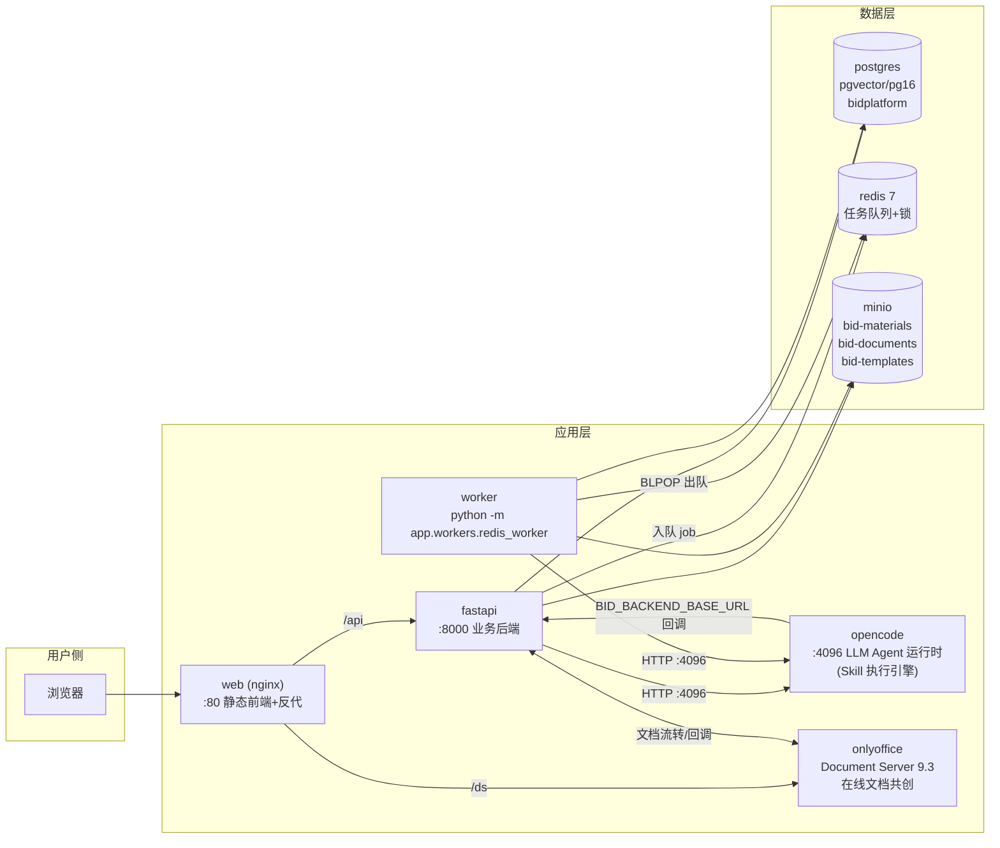
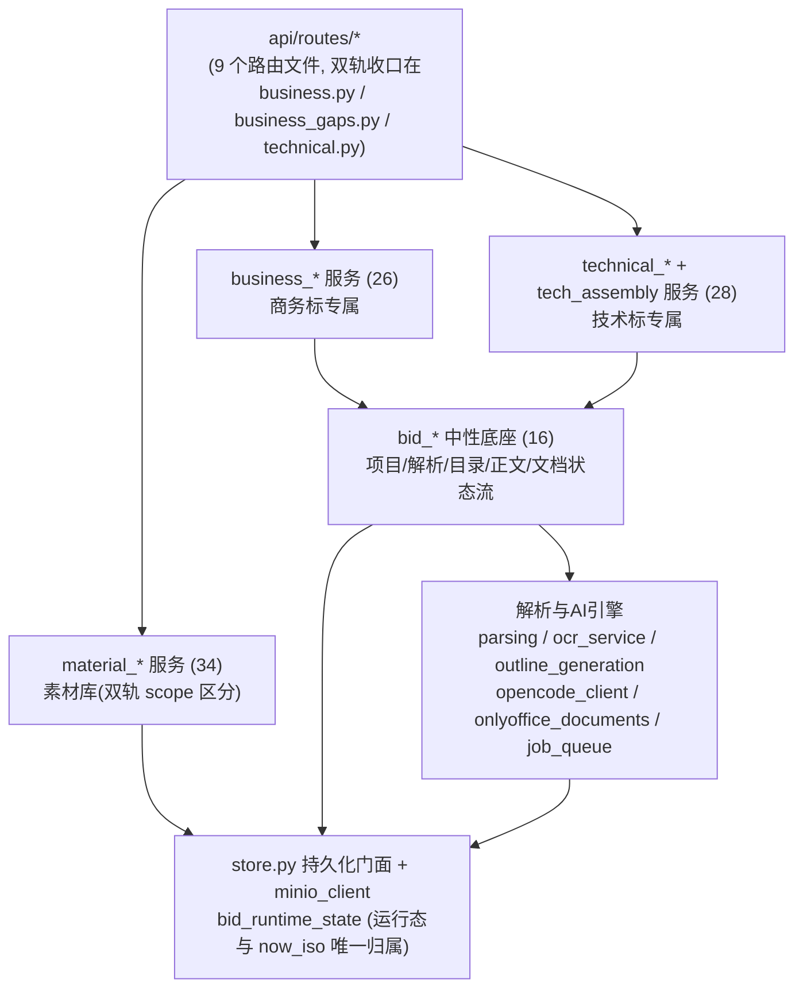
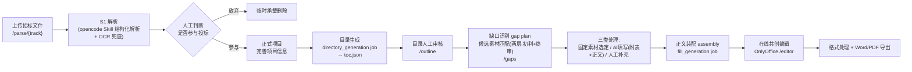

# 00 系统全景

> 事实来源：`code/docker-compose.yml`、`app/main.py`、`app/core/config.py`、`app/api/router.py`、`app/workers/redis_worker.py`、`code/sewpg-bid-backend/README.md`（2026-07-13 核对）。

## 1. 一句话

AI 数智化投标平台：上传招标文件 → AI 解析 → 人工决策参与 → 目录生成 → 缺口识别与素材匹配 → AI 填写/草拟 → 在线共创编辑 → 格式化导出，商务标与技术标**双轨同构、互不越界**。

## 2. 容器拓扑（docker-compose 8 个服务）

关键事实：

- **fastapi、worker、opencode 三个容器共享三个数据卷**：`uploads:/data/uploads`（opencode 只读）、`documents:/data/documents`、`parsed:/data/parsed`。这是 Skill 与后端交换大文件的通道——后端把输入写进卷，opencode 里的 Skill 读卷、产出也写回卷。
- **opencode 是唯一的 LLM 出口**（`OPENCODE_BASE_URL=http://opencode:4096`，默认模型 `big-pickle`，超时 1800s）。所有 AI 能力都封装为 opencode Skill（`bid-tech-*` / `bid-business-*` / `bid-material-*`，位于 `code/sewpg-bid-backend/opencode/skills/`）。
- **worker 与 fastapi 同镜像不同命令**，只跑 `app/workers/redis_worker.py`。
- OCR 走独立配置（`DEFAULT_OCR_MODEL=deepseek-ai/DeepSeek-OCR`），另有 `docker-compose.ocr.yml` 编排。
- postgres 使用 **pgvector** 镜像（向量能力可用），初始化脚本在 `code/initdb/`。

## 3. 数据存储分工

| 存储 | 内容 | 关键位置 |
|---|---|---|
| PostgreSQL `bidplatform` | 结构真值：项目、运行态、素材目录树（`raw_folders`/`raw_files`）、缺口计划、用户会话 | `DATABASE_URL`，`store.py` 为持久化门面 |
| MinIO `bid-materials` | 素材库原始文件字节 | `MINIO_BUCKET_MATERIALS` |
| MinIO `bid-documents` | 项目文档/生成产物 | `MINIO_BUCKET_DOCUMENTS` |
| MinIO `bid-templates` | 模板文件 | `MINIO_BUCKET_TEMPLATES` |
| 数据卷 `documents` | 运行期产物，如 `_runtime/materials/technical_material_index.json`（素材三级目录 JSON 索引，下游解析候选/Wiki/标签的唯一来源） | `DOCUMENTS_DIR` |
| Redis | 生成任务队列、job 状态、生成锁（锁 TTL 7200s，结果 TTL 86400s） | `job_queue.py` |

## 4. 异步任务模型

`redis_worker` 循环 `dequeue_generation_job()`，按 `job.type` 分发三类任务：

| job type | 处理函数 | 用途 |
|---|---|---|
| `directory_generation` | `bid_directory_flow._run_directory_generation_job` | 目录（大纲）生成 |
| `fill_generation` | `bid_generation_flow._run_fill_generation_job`（必须显式绑定 `bidType` 技术标/商务标） | 正文/填写生成 |
| `material_cleaning` | `material_cleaning.clean_material_file_sync` | 素材格式清洗 |

状态流：`mark_job_status(running → succeeded/failed)`，完成后 `release_generation_lock`。前端轮询项目运行态获取进度。

## 5. 后端分层（app/ 之内）

分层规约（来自 `AGENTS.md` 与后端 README）：

- 技术标入口 `/api/technical/...` + `/workspace/tech/...`；商务标入口 `/api/business/...` + `/workspace/business/...`；解析页 `/parse/technical|business`。
- `bid_directory_flow` / `bid_generation_flow` / `bid_document_flow` 是**标类中性底座**，business/technical service 各自包装业务入口。
- 旧 `/api/projects...`、`/api/materials...`、`/api/audit...` 已不注册，仅在防回退测试出现。

## 6. 前端结构（React + Vite）

- 双工作区拆分：`src/workspaces/{business,technical,shared}`，两轨保持相同主路由形态：`template-directory` → `outline` → `gaps` → `editor`。
- 阶段状态机（前端 `*StageFlow.js`）：阶段 1目录生成 → 2审核目录 → 3/4素材匹配 → 5/6共创导出，阶段号映射到上述四个路由。
- 页面清单（每轨 11 个路由）：解析页 `TenderReview`、项目列表、解析结果 `ParseResult`、目录审核 `OutlineReview`、缺口识别 `GapRecognition`、共创编辑 `CoCreationEditor`、素材库 `MaterialDB`、素材 Wiki `MaterialWiki`、审计日志；技术标额外有证书台账 `CertificateLedger`；业绩库两轨共用 `/workspace/shared/materials/performance`。
- `src/pages/` 仅剩 Dashboard / Login / Settings（共享层，按 README 规约逐步抽空）。
- 素材预览以弹窗/浮层嵌在页面内，不设独立路由；解析页不暴露「先新建项目」（上传即后台静默创建临时承载，参与决策后才转正式项目）。

## 7. 全链路一图流（双轨同构）

每个环节的 Input/Output 细节见 `01-商务标主链路.md`、`02-技术标主链路.md`；素材侧数据流见 `03-素材库与Wiki.md`。
