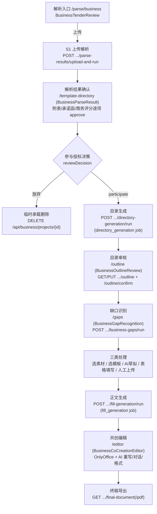

# 01 商务标主链路

> 事实来源：`app/api/routes/business.py`（约 70 个端点）、`app/api/routes/business_gaps.py`（19 个端点）、前端 `workspaces/business/`（2026-07-13 核对）。
> 阅读方式：每个环节按 **Input → 处理 → Output** 描述，标注承载页面、API 与落地的中间数据。

## 0. 端到端总览

## 1. S1 上传解析

| | |
|---|---|
| 页面 | `/parse/business`（BusinessTenderReview）——纯「上传解析」入口，后台静默创建临时承载项目，前端不暴露「先建项目」 |
| API | `POST /api/business/projects/{id}/parse-results/upload-and-run`（`tenderFiles[]` + `templateFiles[]`）；模板可单独补传 `POST .../template-files/upload` |
| Input | 招标文件（pdf/docx 等，见 `ALLOWED_UPLOAD_EXTENSIONS`）、历史模板文件 |
| 处理 | `bid_parse_service.business_parse_service`：文件落 uploads 卷 → opencode Skill 结构化解析（`S1_PARSE_OPENCODE_ENABLED`）→ 产出结构化解析件；扫描件走 OCR 任务（`bid_ocr_service`，端点 `.../ocr/tasks`，候选逐项 `confirm`） |
| Output | 解析结果（项目字段、附表 blankDocx、承诺函、商务评分等「阶段交接件」），进度可轮询 `GET .../parse-results/progress` |
| 中间数据 | uploads/parsed 数据卷 + 项目运行态 `parse_state`；解析产物即下游 S2/S3/AI 填写的输入契约 |

## 2. 解析结果确认（人工质检点①）

- 页面 `/template-directory`（BusinessParseResult）。
- 附表、承诺函支持 OnlyOffice 在线预览/编辑（`.../file` + `.../callback`），逐项或一键 `approve`：`POST .../appendices/{id}/approve`、`.../commitment-letters/{id}/approve`、`.../business-scoring/approve`。
- **Output**：确认后的解析资产成为正式「S1 阶段交接件」。

## 3. 参与决策与项目转正

- 项目列表 `GET /api/business/projects?reviewDecision=participate`（项目总览只展示已确认参与的项目）。
- 完善项目信息：`PUT /api/business/projects/{id}`（客户、风机机型明细=机型+台数+基础形式，见 `docs/完善项目信息选项前端参数传递.md`）。
- 阶段推进：`PUT .../stages/{stage}`；前端阶段机 `businessStageFlow.js`：1目录生成 → 2审核目录 → 3/4素材匹配 → 5/6共创导出。

## 4. 目录生成与审核

| | |
|---|---|
| API | `POST .../directory-generation/run` → 入 Redis 队列 `directory_generation`；状态轮询 `GET .../directory-generation` |
| 处理 | worker → `bid_directory_flow._run_directory_generation_job` → `outline_generation` 准备目录 manifest → 本地规则引擎或 Skill `bid-business-outline-generator` 生成目录 JSON |
| Output | `toc.json`（项目 workspace 内，运行态可从既有 toc.json 恢复） |
| 人工审核 | `/outline` 页面 `GET/PUT .../outline` 编辑目录树，`POST .../outline/confirm` 确认后进入缺口阶段；可对照招标原文（`.../outline/tender-files/{id}/file` OnlyOffice 预览） |

## 5. 缺口识别与素材匹配（核心决策层，人工质检点②）

`POST .../business-gaps/run` → `business_gap_service.run_detection`，两层决策（候选≠决策）：

1. **初判**：Skill `bid-business-gap-planner` 按 `task_mapping_table.json` 把每个目录任务分到 `ready / fill_required / material_required / ai_draft_required / review_required`。
2. **运行时终审 `recompute_task_states`**（每次读取都重算）：已确认 `resolvedArtifacts` → `ready`；有未确认产物/模板候选/素材候选 → `review_required`；否则回初判、`status=needs_input`。

用户处理动作（每个任务卡片）：

| 动作 | API | 落地 |
|---|---|---|
| 选定候选素材 | `POST .../tasks/{id}/select-material` | resolvedArtifacts+1 → ready |
| 选定模板 | `POST .../tasks/{id}/select-template` | 同上 |
| AI 草拟 | `POST .../tasks/{id}/ai-draft` | opencode 草拟正文产物 |
| 表格 AI 填写 | `POST .../tasks/{id}/table-fill` | 以项目事实表+素材为源填表 |
| 人工上传 | `POST .../tasks/{id}/upload(-files)` | 上传即产物 |
| 产物确认/回灌素材库 | `.../confirm-artifact`、`.../sync-artifact-material` | 双向打通素材库 |

支撑数据：**项目事实表**（`GET/PUT .../business-gaps/facts`，`POST .../facts/build` AI 构建）——AI 草拟/填表的结构化事实来源；可选素材列表 `.../selectable-materials`；素材预览 `.../materials/{id}/preview`。

## 6. 正文生成与共创导出

1. **正文装配**：`POST .../fill-generation/run` → 队列 `fill_generation`（显式 `bidType=商务标`）→ `bid_generation_flow` → `business_assembly` 按目录+缺口产物拼装正文 docx。
2. **共创编辑** `/editor`：`GET .../document` 取 OnlyOffice 编辑会话；保存走 `.../document/save` + OnlyOffice `.../document/callback`；AI 能力三件套：`business-chat`（对话）、`business-rewrite/suggest|apply`（选段重写）、`business-format`（格式处理）。
3. **导出**：`GET .../final-document`（Word）、`.../final-document/pdf`（PDF 转换后 `.../pdf/file` 下载）。

## 7. 旁路：素材库与审计（页面级入口）

- 素材库 `/workspace/business/materials/raw`：目录树/文件 CRUD、上传（含 `materialTier`、`businessMaterialKind`、tags、客户归属）、AI 拆分（`business-split/preview|confirm`）、清洗结果预览下载（`cleaned/*`，清洗走 `material_cleaning` 队列）。数据流详见 `03-素材库与Wiki.md`。
- 商务 Wiki `/workspace/business/materials/wiki`：`wiki/bootstrap`（由素材库引用路径生成蓝图）+ 节点 CRUD/移动/附件/AI 摘要刷新。
- 审计 `/workspace/business/logs`：`GET /api/business/audit(/export|/{id})`。
- 业绩库共用入口 `/workspace/shared/materials/performance`（`performance.py` 路由，两轨共享）。
