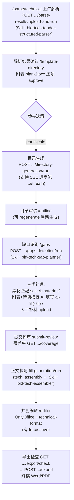
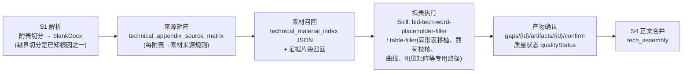

# 02 技术标主链路

> 事实来源：`app/api/routes/technical.py`（约 100 个端点）、前端 `workspaces/technical/`、`docs/20260708-技术标附表AI填写全链路梳理.md`、`docs/anbc_doc/20260701-技术标缺口决策架构对齐商务标方案.md`（2026-07-13 核对）。
> 与商务标同构的环节（上传解析/参与决策/目录/共创/导出）只写差异，公共骨架见 `01-商务标主链路.md`。

## 0. 端到端总览（含技术标特有环节）

## 1. 与商务标的关键差异

| 环节 | 技术标差异 |
|---|---|
| 解析 | Skill `bid-tech-tender-structured-parser`；附表切分产出 blankDocx（每附表一个空表 docx），是后续 AI 填表的目标载体；支持 `parse-results/run`（不重新上传，重跑解析） |
| 目录 | 生成支持 **SSE 进度流**（`GET .../directory-generation/stream`）与 `POST .../outline/regenerate` |
| 缺口 | 缺口对象是「目录节点+附表任务」双形态；有 `gaps/recheck`（重算）、`gaps/submit-review`（提交评审）与 `PATCH materials/missing/{id}`（缺料台账） |
| 覆盖率 | `GET .../coverage`（technical_coverage_service），量化每章素材覆盖情况 |
| 导出 | 多一道 `GET .../export/check` 前置检查，再 `POST .../export` |
| 素材库 | 多机型维度（`turbine-model-options`、按 `turbineModel` 过滤）、三级目录 JSON 索引（`GET /api/technical/materials/index`）、标签 Excel 批量导入（`tag-import/preview|commit`）、批量删除/打标（`batch-delete`/`batch-tags`）、**证书台账**（见 §4） |

## 2. 缺口决策（两层架构，2026-07 对齐商务标）

`POST .../gaps-detection/run` → `technical_gap_service.run_detection` → Skill `bid-tech-gap-planner`：

- **第一层初判**（`build_gap_plan`）：章节主素材/附表规则/文件级候选匹配/主题弱关联召回（含证据片段召回），产出 `decision / usage / candidateMaterials / fillTasks / appendixTasks`。
- **第二层终审**（`_recompute_technical_gap_decisions`，挂在 `technical_gap_planner.py` 确定性后处理）：
  1. `resolvedArtifacts` 非空 → `ready`
  2. `fillTasks` 未全部完成 → `fill_required`（需 AI 处理后才能 merge）
  3. 仅有 `candidateMaterials` → `review_required`（有候选待人工确认）
  4. 结构性节点 → `ready`；都没有 → `material_required`

前端动作映射（`technicalActionMode`）：`fill_required`+`fillTasks` → **AI填写**；`review_required` → 素材匹配卡片；`material_required` → 人工补料。

## 3. 附表 AI 填写链路（技术标核心难点）

- Input：blankDocx（目标表）+ 来源素材（docx/xlsx，PDF 证书类当前不可读，需 OCR 立项）+ 项目事实表（`gaps/facts`）。
- Output：填写后的 docx 产物（gap artifact），确认后进入正文装配。
- 单位换算规约：按目标表单位列换算数量级、只填数值不重复写单位（AGENTS.md 团队规约）。
- 质量基线：金标反评体系（tolerant coverage，见 `docs/20260708-技术标附表AI填写全链路梳理.md`），当前 86.9%；主要残留缺口：PDF 证书抽取、doc 表格键值抽取、续表/矩阵映射长尾。

## 4. 证书台账（技术标特有旁路）

页面 `/workspace/tech/materials/certificates`（TechnicalCertificateLedger）：

- 台账查询 `GET /api/technical/materials/certificates`；AI 识别有效期 `POST .../certificates/{file_id}/recognize`；增量扫描 `POST .../certificates/incremental`；适用范围维护 `PUT .../certificates/scopes`；建议 `GET .../certificates/suggestions`。
- 数据挂在素材文件上（`material_certificate_time`），为附表中「认证机构/证书编号/有效期」类字段提供结构化来源。

## 5. 素材索引与 Wiki（技术标侧入口）

- 三级目录 JSON 索引：`GET /api/technical/materials/index`（空则即时重建）；节点打标 `PUT .../index/tags`（tag 真值在 JSON 索引内，认领键 RAW-id/folderId）。
- Wiki：`POST .../wiki/bootstrap`（从索引生成蓝图）+ 节点 CRUD/移动/附件/`refresh-summary`（AI 摘要）。
- 机制细节见 `03-素材库与Wiki.md` 与 `docs/anbc_doc/20260619-技术标JSON索引与Wiki系统总览.md`。
