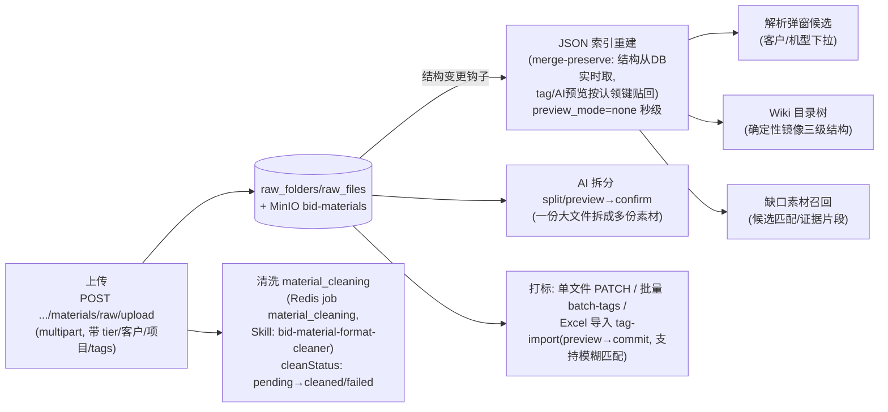

# 03 素材库与 Wiki 数据流

> 事实来源：`app/api/routes/business.py|technical.py` 素材段、`app/services/material_*`、`docs/anbc_doc/20260619-技术标JSON索引与Wiki系统总览.md`（2026-07-13 核对）。
> 素材库是双轨共用的服务群（`material_*` 34 个模块），通过 scope（`material_folder_scope`/`material_wiki_scope`）区分商务/技术两套目录空间；两轨各自的门面是 `business_material_store` / `technical_material_store`。

## 1. 存储模型

| 层 | 真值位置 | 说明 |
|---|---|---|
| 目录结构 | PostgreSQL `raw_folders` | 一级=标类（技术标/商务标），二级=档位 tier（standard 标准文件 / customer 客户 / project 项目），三级=业务目录；更深层归并到三级祖先 |
| 文件元数据 | PostgreSQL `raw_files`（RAW-xxxx id） | 名称、tier、客户/项目归属、`cleanStatus`、tags、`businessMaterialKind`（商务侧）、`turbineModel`（技术侧）、证书时间等 ext 字段 |
| 文件字节 | MinIO `bid-materials` | 原始件 + 清洗产物（cleaned docx） |
| 结构快照 | 数据卷 `documents:/data/documents/_runtime/materials/technical_material_index.json` | 三级目录 JSON 索引（schemaVersion=2），下游唯一读取来源 |

## 2. 素材进入与治理（Input → 处理 → Output）

关键机制：

- **索引重建三态 `preview_mode`**：`none`（结构钩子，秒级不调 LLM）/ `cached`（重建 Wiki 时贴回 DB 缓存预览）/ `generate`（后台任务增量调 LLM 生成文件级 AI 预览：导读/要点/关键参数/召回提示，缓存在 `ext_fields.techWikiPreview`）。
- **tag 真值在 JSON 索引**（schemaVersion=2 起），文件按 `RAW-id`、目录按 `folderId` 认领，改名/移动不丢 tag；rebuild 与人工打 tag 串行 + 原子写（.tmp → os.replace）。
- **清洗**：上传后可触发 `material_cleaning` 队列任务，产出 cleaned docx（`.../cleaned/preview|content`），`cleanStatus` 四态 `cleaned|pending|original_only|failed`。

## 3. Wiki 生成与维护

| 步骤 | API / 模块 | Input → Output |
|---|---|---|
| 蓝图生成 | `POST .../materials/wiki/bootstrap` → `business_wiki_generation` / `technical_wiki_generation`（共用 `wiki_blueprint_common`） | 素材库引用路径/JSON 索引 → Wiki 节点树蓝图（mode=create，可回退确定性生成） |
| 节点维护 | `wiki_create/update/delete/move` | 人工整理树结构 |
| 附件 | `wiki/{node}/attachments`（上传/下载/删除） | 节点挂素材附件（MinIO） |
| AI 摘要 | `POST .../wiki/{node}/refresh-summary` | 节点内容 → LLM 摘要 |
| 导出/健康度 | `wiki_export` / `wiki_health` | Wiki 树 → 导出件 / 健康检查报告 |

## 4. 业绩库（两轨共用）

- 路由 `app/api/routes/performance.py`，页面 `/workspace/shared/materials/performance`。
- 服务：`performance_library_service`（业绩条目库）、`performance_package_service`（业绩打包）、`performance_material_resolver`（业绩→素材解析，供缺口填写引用）。
- 设计文档：`doc/20260603-业绩库项目级拆分与合同附件设计说明.md`、`docs/anbc_doc/20260606-业绩库下游使用Handoff.md`。

## 5. 下游消费关系（谁在读素材库）

| 消费方 | 读什么 | 用在哪 |
|---|---|---|
| S1 解析弹窗 | JSON 索引 tiers/customers/机型 | 完善项目信息选项 |
| 缺口计划（两轨 gap planner） | 索引 + tags + AI 预览 + 证据片段 | 候选素材匹配、来源矩阵路由 |
| AI 填写 / 草拟 | 素材文件字节（docx/xlsx）+ 项目事实表 | 附表填写、正文草拟 |
| 正文装配 assembly | 已确认 gap 产物 + 素材导出 | S4 合并 |
| Wiki | 索引结构 + 节点附件 | 知识沉淀与人工浏览 |
